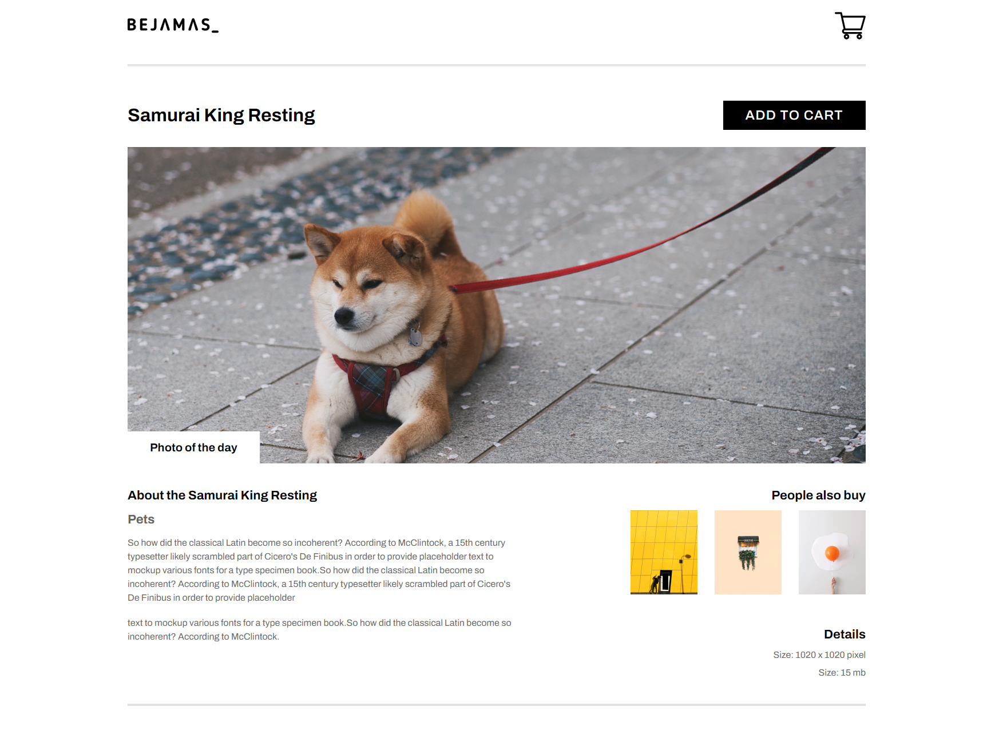

## Bejamas - Web Shop

**Welcome to the Pet Shop**, your guide to the pawsome world of our online pet marketplace. This document serves as a comprehensive resource, offering insights into the heart and soul of our project. Whether you're a developer, stakeholder, or just a curious cat lover, let's embark on this journey together.

🐾 **Explore. Adopt. Love.**

### Overview:

At Pet Shop, we believe in creating a seamless experience for pet enthusiasts to connect with their furry companions. In this documentation, you'll find:

**Features**: Uncover the rich set of functionalities that make our pet marketplace a delight for users. From browsing adorable pets to a secure checkout process, we've got it covered.

**Architecture**: Peek behind the scenes and explore the technology that powers our platform. The project follows a modern  architecture, with basic web development tools leading the way.

**Technologies Used**: Get acquainted with the technologies that form the backbone of Pet Shop. From HTML and CSS on the front-end to Javascript who create functionalities, we've carefully chosen tools to ensure a robust and reliable system.

**Thank you for being a part of the Pet Shop family!**
